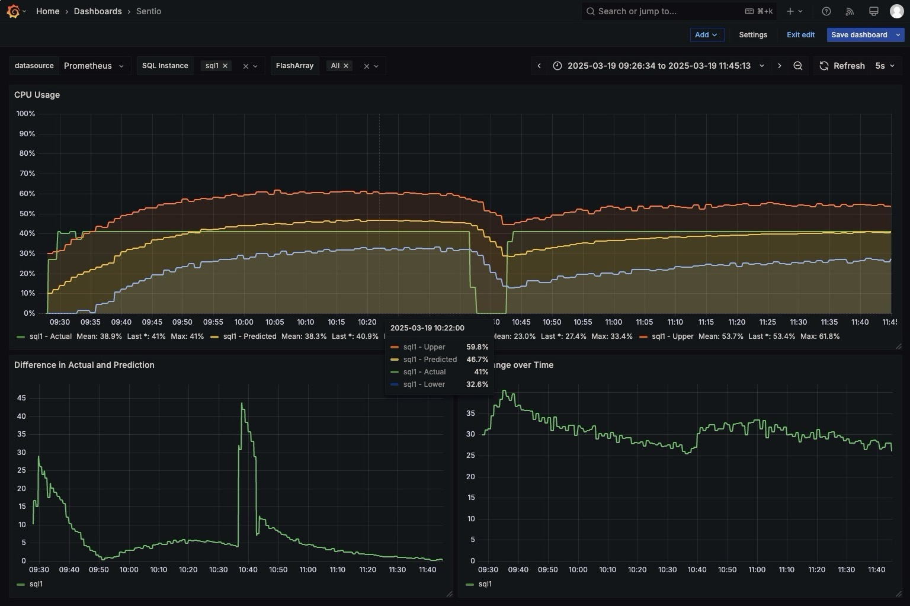

<div align="center">
    <h1>Sentio - Anomaly detection</h1>
    <p>
        Anomaly detection for docker compose workloads using Prometheus, Grafana and Prophet.
    </p>
    <!-- Badges -->
    <p>
        <a href="https://github.com/battagel/sentio/network/members">
            
        </a>
        <a href="https://github.com/battagel/sentio/stargazers">
            
        </a>
        <a href="https://github.com/battagel/sentio/issues/">
            
        </a>
    </p>
    <h4>
        <a href="https://github.com/battagel/sentio/issues/">Report Bug</a>
        <span> · </span>
        <a href="https://github.com/battagel/sentio/issues/">Request Feature</a>
    </h4>
</div>

<br />

<!-- Table of Contents -->

# Table of Contents

- [About the Project](#about-the-project)
  - [Screenshots](#screenshots)
  - [Tech Stack](#tech-stack)
  - [Features](#features)
- [Getting Started](#getting-started)
  - [Prerequisites](#prerequisites)
  - [Installation](#installation)
  - [Linting](#linting)
- [Usage](#usage)
- [Contributing](#contributing)
- [FAQ](#faq)
- [License](#license)
- [Contact](#contact)
- [Acknowledgements](#acknowledgements)

<!-- About the Project -->

## About the Project

The Sentio container will take Prometheus' recorded metrics and predict the next
value (yhat) with an error range (yhat_upper, yhat_lower). This range can be
used to detect anomalous changes in the target metrics. We can then use an alert
algorithm to determine when to raise an alarm for the anomaly.

<!-- Screenshots -->

### Screenshots

<div align="center">
  
</div>

<!-- TechStack -->

### Tech Stack

<details>
    <summary>ML</summary>
    <ul>
        <li><a href="https://facebook.github.io/prophet/">Prophet</a></li>
    </ul>
</details>
<details>
    <summary>Metrics</summary>
    <ul>
        <li><a href="https://prometheus.io/">Prometheus</a></li>
        <li><a href="https://grafana.com/">Grafana</a></li>
        <li><a href="https://www.influxdata.com/time-series-platform/telegraf/">Telegraf</a></li>
    </ul>
</details>

<!-- Features -->

### Features

- Detect anomalous activity on running docker compose workflows

<!-- Getting Started -->

## Getting Started

<!-- Prerequisites -->

### Prerequisites

This project requires docker and docker compose.

<!-- Installation -->

### Installation

Clone the repo. In the `demos/` directory there are three demos each with a `README.md` available.

<!-- Linting -->

### Linting

```bash
pylint .
```

<!-- Usage -->

## Usage

Launch each demo with the instructions in the `README.md`.

<!-- Contributing -->

## Contributing

Contributions are always welcome!

<!-- FAQ -->

## FAQ

<!-- License -->

## License

MIT

<!-- Contact -->

## Contact

Matthew Battagel - matthew@battagel.me.uk - [GitHub](https://github.com/battagel)

<!-- Acknowledgments -->

## Acknowledgements

A big thanks to all of these resources:

- [Detecting Workload Anomalies with Prometheus and Machine Learning by Anthony Nocentino](https://www.youtube.com/watch?v=AleqE33JTgU)
